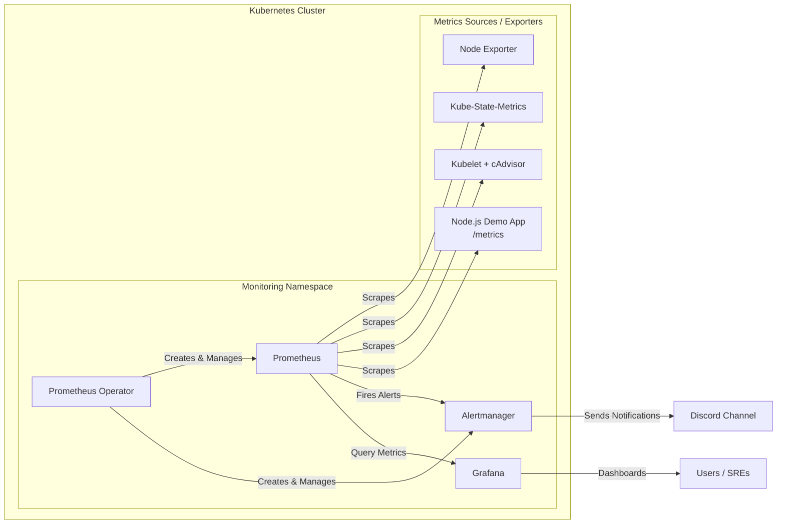

# Kubernetes Monitoring Stack — Prometheus, Alertmanager & Grafana

This project demonstrates a complete end-to-end Kubernetes monitoring and alerting setup using Prometheus Operator, Alertmanager, Grafana, and various exporters.
It also includes custom alerts, Discord integration, and application-level monitoring for a Node.js app exposing Prometheus metrics.

## 📘 Overview

The monitoring architecture includes the following key components:

* Prometheus Operator → Manages all Prometheus and Alertmanager custom resources.

* Prometheus → Scrapes metrics from nodes, pods, and applications.

* Alertmanager → Handles alert routing and sends notifications to Discord.

* Grafana → Visualizes metrics via dashboards.

* Node Exporter → Exports host-level metrics (CPU, memory, disk).

* Kube-State-Metrics → Exposes cluster object states.

* Kubelet + cAdvisor → Provides per-pod and per-container resource metrics.

* Node.js Demo App → Sample web app exporting Prometheus-compatible metrics.

## 🏗️ Architecture Diagram   


               
          

            
## 🧱 Step-by-Step Setup
### 1️⃣ Install Prometheus Operator & CRDs

Objective:
* Deploy the Prometheus Operator and its required CRDs to manage all Prometheus, Alertmanager, and related custom resources.

```bash
kubectl create -f https://raw.githubusercontent.com/prometheus-operator/prometheus-operator/master/bundle.yaml
```

### 2️⃣ Configure RBAC for Prometheus

Objective:
* Grant Prometheus permissions to access nodes, services, and pods for metric collection.
* Include Service Account, Cluster Role definition and Role Bindings. 

```bash
kubectl apply -f prom_rbac.yaml
```

### 3️⃣ Deploy Prometheus StatefulSet

Objective:
Deploy Prometheus as a StatefulSet with persistent data storage and Operator-managed lifecycle.

```bash
kubectl apply -f prometheus.yaml
```

### 4️⃣ Create Prometheus Service

Objective:
* Expose Prometheus internally for service discovery and scraping.

```bash
kubectl apply -f prometheus_svc.yaml
```

### 5️⃣ Deploy Node.js Application with Metrics

Objective:
* Deploy a sample Node.js app that exposes /metrics endpoint for Prometheus scraping via ServiceMonitor.

```bash

kubectl apply -f nodejs_prometheus_deployment.yaml

kubetcl apply -f nodejs_prometheus_service.yaml
 
kubetcl apply -f nodejs_prometheus_service_monitor.yaml  
```

* Verify the app exposes Prometheus metrics such as request rate, CPU, memory, heap, GC stats, etc.

### 6️⃣ Deploy Grafana

Objective:
* Install Grafana for visualizing Prometheus metrics through dashboards.

```bash
kubectl apply -f grafana_deploy_svc.yaml
```
Outcome:
* Grafana UI accessible at NodeIP:30030, pre-configured with Prometheus as data source.

### 7️⃣ Deploy Alertmanager & RBAC

Objective:
* Set up Alertmanager for alert routing and integration with Discord.
* Grant required permissions via RBAC.

```bash

kubectl apply -f alertmanager_rbac.yaml
kubectl apply -f alertmanager_deploy.yaml
kubectl apply -f alertmanager_svc.yaml
```

### 8️⃣ Configure Alertmanager for Discord Notifications

Objective:
* Create a Kubernetes Secret containing the Alertmanager configuration to send alerts to a Discord webhook.

```bash 
kubectl apply -f alertmanager_secret_config.yaml
```

Result:
* Alertmanager routes alerts from Prometheus to Discord channels based on severity and labels.

### 9️⃣ Define Prometheus Alert Rules

Objective:
* Define PrometheusRule CRD to detect system and application issues such as:

* CrashLoopBackOff

* ImagePullBackOff

* OOMKilled

*High CPU / Memory

* Node Down

* Network Unavailable

* Disk Pressure

```bash
kubectl apply -f prometheus_alert_rules.yaml
```

Result:
* Alerts visible under Prometheus → Alerts, firing when thresholds are met and sent to Discord.

### 🔟 Deploy Exporters
A. Kube-State-Metrics

Objective:
Export cluster object state metrics (Deployments, Pods, StatefulSets, etc.) to Prometheus.

```bash
kubectl apply -f kube_state_metrics.yaml
```

B. Node Exporter

Objective:
Expose node-level metrics (CPU, RAM, filesystem) using a DaemonSet.

```bash
kubectl apply -f node_exporter.yaml
```

### 1️⃣1️⃣ Configure ServiceMonitors for Exporters

Objective:
Tell Prometheus Operator to scrape metrics from Kube-State-Metrics and Node Exporter services.

```bash

kubectl apply -f kube_state_metrics_service_monitor.yaml

kubectl apply -f node_exporter_service_monitor.yaml
```

Result:
* Prometheus now collects node and cluster-level metrics.

### 1️⃣2️⃣ Enable Kubelet and cAdvisor Metrics

Objective:
Scrape kubelet /metrics and /metrics/cadvisor for per-pod and per-container CPU/memory data.

```bash

kubectl apply -f kubelet-service.yaml

kubectl apply -f kubelet-servicemonitor.yaml
```

Result:
* Prometheus discovers new kubelet and kubelet-cadvisor targets.
* All pod and container metrics (CPU, memory, I/O) become visible.

### 1️⃣3️⃣ Validate Metrics & Alerts

Objectives:

* View targets via Prometheus → Status → Targets

* Run PromQL queries for:

* Per-pod CPU / Memory usage

* Top resource-consuming pods

* Simulate test alerts (CrashLoopBackOff, ImagePullBackOff)

```bash
kubectl run badpod --image=nonexistent:latest
kubectl run crashloop-demo --image=busybox --restart=Always --command -- sh -c "sleep 2; exit 1"
```

Result:
* Prometheus alerts trigger and notifications sent to Discord.

### 1️⃣4️⃣ Verify Setup

Check:
```bash
kubectl get prometheusrules

kubectl get prometheus

kubectl logs -l alertmanager=alertmanager

kubectl exec -it $(kubectl get pod -l prometheus=prometheus -o name) -- prometheus --version
```

### 1️⃣5️⃣ (Optional) Install via Helm

Objective:
Install the entire monitoring stack using the official Helm chart to demonstrate GitOps or easier management.

```bash

helm repo add prometheus-community https://prometheus-community.github.io/helm-charts
helm repo update
helm install prometheus prometheus-community/kube-prometheus-stack
```

Outcome:
```bash
Prometheus, Alertmanager, Grafana, exporters, and CRDs auto-installed and preconfigured.

1️⃣ Prometheus Operator Installed
       ↓
2️⃣ Prometheus + Alertmanager CRDs Created
       ↓
3️⃣ Exporters (Node, Kube-State, Kubelet) Deploy
       ↓
4️⃣ ServiceMonitors → Prometheus Discovers Targets
       ↓
5️⃣ Prometheus Scrapes Metrics
       ↓
6️⃣ PrometheusRules Evaluate Alerts
       ↓
7️⃣ Alertmanager Routes Alerts → Discord
       ↓
8️⃣ Grafana Visualizes Metrics & Alerts
```

After completing all steps, your setup provides:

* Layer	Metric Source	Purpose
* Node-level	Node Exporter	CPU, Memory, Disk
* Cluster-level	Kube-State-Metrics	Pod, Deployment, ReplicaSet state
* Pod/Container-level	Kubelet + cAdvisor	Per-pod CPU, Memory, Network
* App-level	Node.js Metrics	Requests, Heap, Event Loop, GC
* Alerting	PrometheusRules + Alertmanager	Health & resource alerts
* Visualization	Grafana	Unified dashboards for all layers
### 📊 Validation Checks

```bash
* Prometheus UI → http://<NodeIP>:9090

* Grafana UI → http://<NodeIP>:30030

* Alertmanager UI → http://<NodeIP>:30093

* Discord Channel → Alert notifications visible
```

### 🌟 Highlights

* End-to-end observability stack built from manifests.

* Works across any Kubernetes cluster.

* Fully integrated alerting via Discord.

* Modular — can easily be replaced by Helm or GitOps.

* Extensible — supports PodMonitor, custom exporters, and app metrics.
